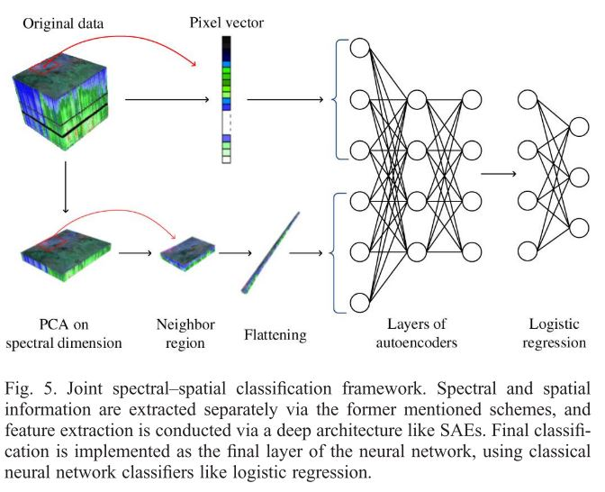

# SAE-LR
## Introduction
This is a reproduction of *Deep Learning-Based Classification of Hyperspectral Data*.

## Requirements
* pytorch 1.3
* scikit-learn
* scipy
* visdom

## Experiment
模型分别在PaviaU, Salinas和KSC这三个基准数据集上进行测试。实验总共分为三组，分别为每类样本量为10，每类样本量为50和每类样本量为100。为了减少误差，每组实验分别进行10次，最终的准确率取10次实验的平均值。

在PaviaU数据集上的准确率（%）如下表所示：

<table>
<tr align="center">
<td colspan="6">PaviaU</td>
</tr>
<tr align="center">
<td colspan="2">10</td>
<td colspan="2">50</td>
<td colspan="2">100</td>
</tr>
<tr align="center">
<td>mean</td>
<td>std</td>
<td>mean</td>
<td>std</td>
<td>mean</td>
<td>std</td>
</tr>
<tr align="center">
<td>66.05</td>
<td>2.33</td>
<td>77.42</td>
<td>3.25</td>
<td>81.44</td>
<td>0.99</td>
</tr>
</table>

在Salinas数据集上的准确率（%）如下表所示：

<table>
<tr align="center">
<td colspan="6">Salinas</td>
</tr>
<tr align="center">
<td colspan="2">10</td>
<td colspan="2">50</td>
<td colspan="2">100</td>
</tr>
<tr align="center">
<td>mean</td>
<td>std</td>
<td>mean</td>
<td>std</td>
<td>mean</td>
<td>std</td>
</tr>
<tr align="center">
<td>67.43</td>
<td>1.26</td>
<td>79.49</td>
<td>2.90</td>
<td>81.95</td>
<td>1.08</td>
</tr>
</table>

在KSC数据集上的准确率（%）如下表所示：
<table>
<tr align="center">
<td colspan="6">KSC</td>
</tr>
<tr align="center">
<td colspan="2">10</td>
<td colspan="2">50</td>
<td colspan="2">100</td>
</tr>
<tr align="center">
<td>mean</td>
<td>std</td>
<td>mean</td>
<td>std</td>
<td>mean</td>
<td>std</td>
</tr>
<tr align="center">
<td>72.68</td>
<td>2.17</td>
<td>84.93</td>
<td>0.98</td>
<td>89.15</td>
<td>0.48</td>
</tr>
</table>

## Runing the code
贪婪逐层训练auto-encoder `python TrainAutoEncoder --epl xx --name xx --lr xx`

Fine-tuning `python CrossTrain.py --name xx --epoch xx --lr xx`